# Hi, I'm Chris 👋

I have been thinking about, designing, building, and managing digital products for the past 17 years. I am proficient with Elixir, JavaScript, and TypeScript, amongst others, and exploring Rust and Go at the moment. My work has happened mostly behind closed doors in the past, but in 2023 I plan to change that. Currently, I am working on product management tooling and diving into generative art.

I would love to connect with fellow product builders. Just message me via my [website](https://madebyherzblut.com/legal-notice/) or [LinkedIn](https://www.linkedin.com/in/csch/).
